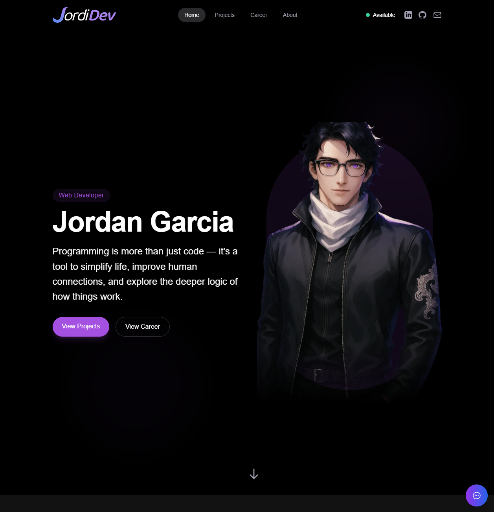

# Jordan Garcia - Web Developer Portfolio

> Programming is more than just code — it's a tool to simplify life, improve human connections, and explore the deeper logic of how things work.

## 🌟 Overview

Welcome to my personal portfolio website built with Vue.js 3! This portfolio showcases my journey as a web developer, featuring my professional experience, projects, and philosophy around creating human-centered digital experiences.

[\[**Live Portfolio**\]](https://jordidevmx-portfolio.netlify.app/)

## 📸 Portfolio Preview



## 🚀 About Me

I'm **Jordan Garcia**, a passionate web developer driven by the desire to build technology that makes life easier, faster, and more connected. My focus is on creating clean, functional, and human-centered digital experiences.

### My Journey

- 🎓 Computer Engineering student at the University of Guadalajara
- 💼 5+ years of experience in the tech industry
- 🌎 Remote work experience across multiple companies
- 🔧 Developed tools for businesses ranging from industrial automation to digital banking

### Development Philosophy

- **Human-Centered**: Building with empathy to enhance real lives and relationships
- **Purpose-Driven**: Every line of code serves a greater good
- **Simplicity & Clarity**: Ensuring users can interact with systems with ease
- **Curiosity-First**: Driven to understand how everything works

## 🛠️ Tech Stack

This portfolio is built using modern web technologies:

### Frontend

- **Vue.js 3** - Progressive JavaScript framework with Composition API
- **Vite** - Fast build tool and development server
- **Tailwind CSS** - Utility-first CSS framework for styling
- **Heroicons** - Beautiful hand-crafted SVG icons

### Development Tools

- **TypeScript** - Type-safe JavaScript
- **Prettier** - Code formatting
- **ESLint** - Code linting
- **PostCSS** - CSS processing

### Features

- 📱 Fully responsive design
- ⚡ Smooth animations and transitions
- 🤖 Integrated AI chatbot
- 🎨 Modern UI/UX design

## 🎯 Portfolio Sections

### 1. Hero Section

Introducing myself with a compelling tagline and call-to-action buttons leading to projects and career sections.

### 2. Skillset

- **Web Design**: Brand identity, visual communication, digital illustration
- **User Interface**: Responsive web design, mobile app interfaces, design systems
- **User Experience**: User research, usability testing, information architecture

### 3. Projects Showcase

Featuring 6 key projects:

#### 🏭 PLC Company - Industrial Automation Platform

- **Status**: Work in Progress
- **Description**: Custom B2B web solution with product tracking, smart quoting, and AI assistant
- **Technologies**: UX/UI Design, Data Visualization, AI Integration

#### 💷 Bankist - Digital Bank Frontend

- **Status**: Live
- **Description**: Modern digital bank frontend with minimalist UI
- **Technologies**: UI Design, Responsive Design, Frontend
- **Live Demo**: [Bankist Interactive](https://bankist-interactive.netlify.app/)

#### 🌤️ Weather Dashboard

- **Status**: Live
- **Description**: Functional weather dashboard with worldwide city data
- **Technologies**: API Integration, Data Visualization
- **Live Demo**: [Weather App](https://jordi-weather-app.netlify.app/)

#### ✈️ Travel Destinations SPA

- **Status**: Live
- **Description**: Vue 3 single-page application with dynamic routing
- **Technologies**: Vue 3, Vue Router
- **Live Demo**: [Travel Destinations](https://routing-compositions-api.netlify.app/)

#### ⚡ VoltNest - EV Charging Platform

- **Status**: Work in Progress
- **Description**: Flutter app connecting EV owners with charging stations
- **Technologies**: Flutter, Geolocation Services

#### 🎲 Pig Game - Dice Duel Edition

- **Status**: Live
- **Description**: Two-player interactive dice game with anime-inspired visuals
- **Technologies**: Web App, UI Design, JavaScript Game Logic
- **Live Demo**: [Silver Wolf Dice Game](https://silverwolf-dice-game.netlify.app/)

### 4. Career Timeline

Detailed professional experience including:

- **Frontend Developer Trainee** at ZendLogic (Feb 2025 - Present)
- **Tech Support Representative** at BigCommerce (Oct 2023 - Jan 2025)
- **Product Acquisition Agent** at Nubank (Jun 2022 - May 2023)
- **Desktop Support Technician** at iNet Academy (May 2021 - May 2022)
- **Customer Support Specialist** at various Call Centers (Mar 2017 - Apr 2021)

### 5. About Me

Personal journey, development philosophy, and core values that drive my work.

### 6. Contact Section

Multiple ways to connect and collaborate.

```

## 📁 Project Structure

```

portfolio/
├── public/
│ ├── career-imgs/ # Career section images
│ ├── projects-imgs/ # Project showcase images
│ ├── projects-videos/ # Project demo videos
│ └── yo-1.webp, yo-2.webp # Personal photos
├── src/
│ ├── components/
│ │ ├── layout/ # Header, Footer components
│ │ ├── sections/ # Main page sections
│ │ │ ├── Hero.vue
│ │ │ ├── About.vue
│ │ │ ├── Skillset.vue
│ │ │ ├── Projects.vue
│ │ │ ├── Career.vue
│ │ │ └── Contact.vue
│ │ └── ui/ # Reusable UI components
│ │ ├── Button.vue
│ │ ├── Card.vue
│ │ ├── ChatBot.vue
│ │ ├── LoadingSpinner.vue
│ │ └── ModalWindow.vue
│ ├── App.vue # Main application component
│ └── main.js # Application entry point
├── tailwind.config.js # Tailwind CSS configuration
├── vite.config.js # Vite configuration
└── package.json # Project dependencies

```

## 🎨 Design Features

- **Responsive Design**: Optimized for all device sizes
- **Smooth Animations**: Intersection Observer API for scroll-based animations
- **Modern UI**: Clean, professional design with attention to detail
- **Interactive Elements**: Hover effects, modals, and dynamic content
- **Performance Optimized**: Lazy loading, optimized images, and efficient code

## 🤖 ChatBot Integration

The portfolio includes an integrated chatbot feature that allows visitors to:
- Ask questions about my experience and projects
- Get detailed information about my technical skills
- Learn more about my career journey
- Receive assistance with portfolio navigation

## 📱 Responsive Design

The portfolio is fully responsive and optimized for:
- 📱 Mobile devices (320px and up)
- 📟 Tablets (768px and up)
- 💻 Laptops (1024px and up)
- 🖥️ Desktop displays (1280px and up)

## 🎯 Performance

- ⚡ Fast loading times with Vite
- 🖼️ Optimized images (WebP format)
- 📦 Code splitting and lazy loading
- 🎨 Efficient CSS with Tailwind
- 🔧 Minimal JavaScript bundle

## 📧 Contact

Interested in collaborating or have questions about my work?

- **Email**: https://jordidevmx-portfolio.netlify.app/
- **LinkedIn**: https://www.linkedin.com/in/jordidev-mx/
- **GitHub**: https://github.com/MysticKarax
- **Portfolio**: https://jordidevmx-portfolio.netlify.app/

## 🙏 Acknowledgments

- Vue.js team for the amazing framework
- Tailwind CSS for the utility-first approach
- Heroicons for beautiful icons
- The open-source community for inspiration and tools

---


```
